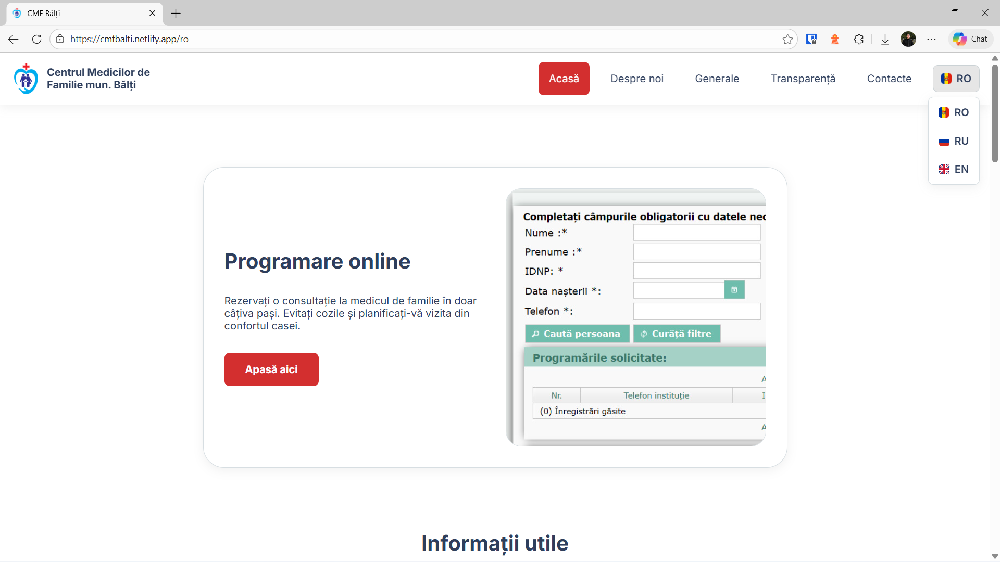
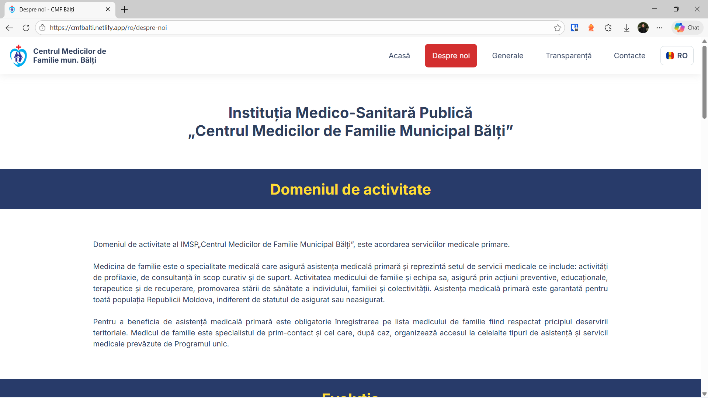
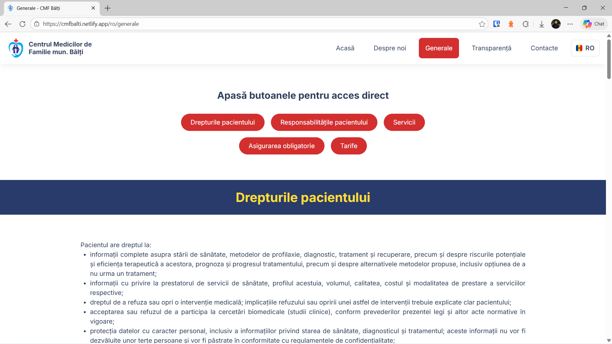
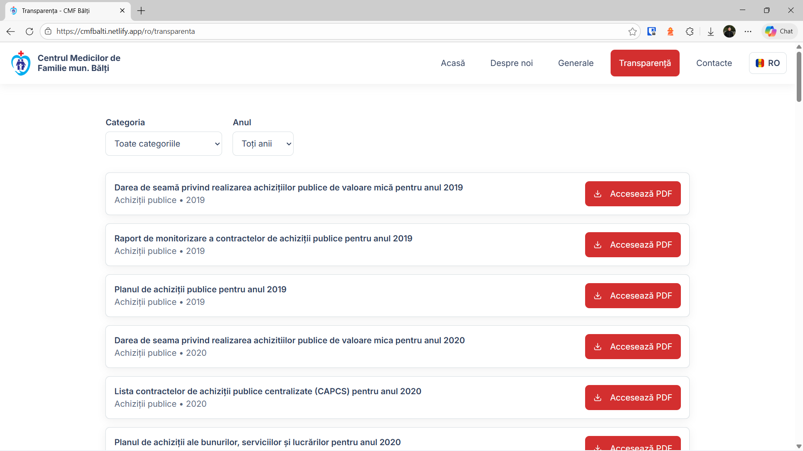
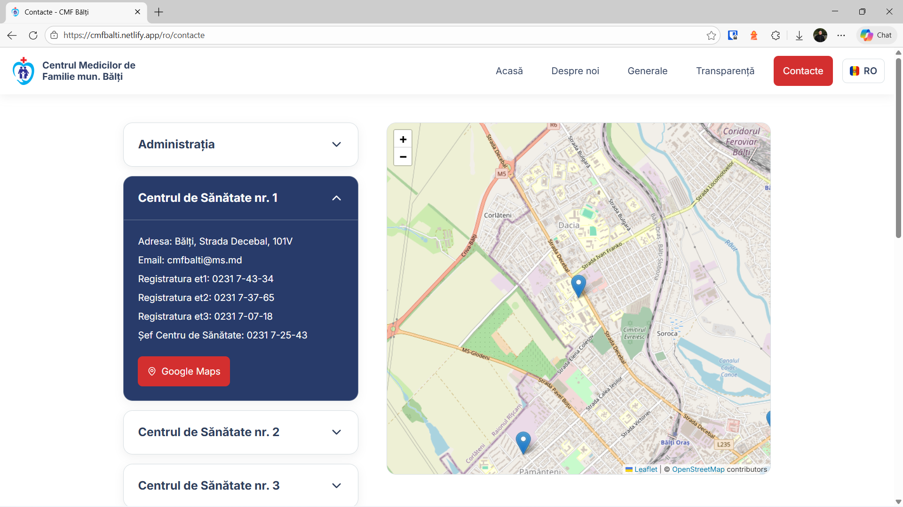
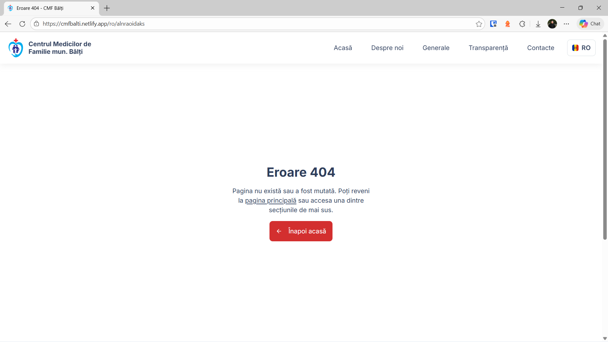

# cmf-balti

Concept website for [Centrul Medicilor de Familie mun. Bălți](https://cmf-balti.md/).

This started as a simple HTML/CSS/JS project for a university internship. I ended up falling in love with it and expanded it into a full Next.js application with multilingual static site generation, SEO, and a clean UI.

## Live Site
- https://cmfbalti.netlify.app/

## Features
- Multi-language UI (Romanian default, Russian, and English)
- Static site generation (SSG) with localized routing
- Interactive map for medical center locations (Leaflet)
- Document filtering with shareable URL parameters
- Full SEO support (metadata, OpenGraph, JSON-LD schema, sitemap.xml)
- Responsive design with mobile navigation

## Tech Stack
- Next.js 16 (App Router)
- React 19
- next-intl
- Leaflet + react-leaflet
- Lucide React
- Vanilla CSS

## Screenshots







## Local Development
```bash
npm install
npm run dev
```

## Build
```bash
npm run build
npm run start
```

## Deployment
Hosted on Netlify. Any push to the main branch triggers a new build.

## Project Structure
```
cmf_balti/
├── public/              # Static assets (images, flags, logos)
├── src/
│   ├── app/             # Next.js App Router (pages, layouts, sitemap, robots, manifest)
│   ├── components/      # UI components (Navbar, Footer, Leaflet map, Filters)
│   ├── i18n/            # Routing and request configuration for next-intl
│   ├── locales/         # Translation files (ro.json, ru.json, en.json)
│   ├── styles/          # Page and shared styles
│   └── proxy.js         # Internationalization middleware proxy
├── next.config.mjs
└── package.json
```
